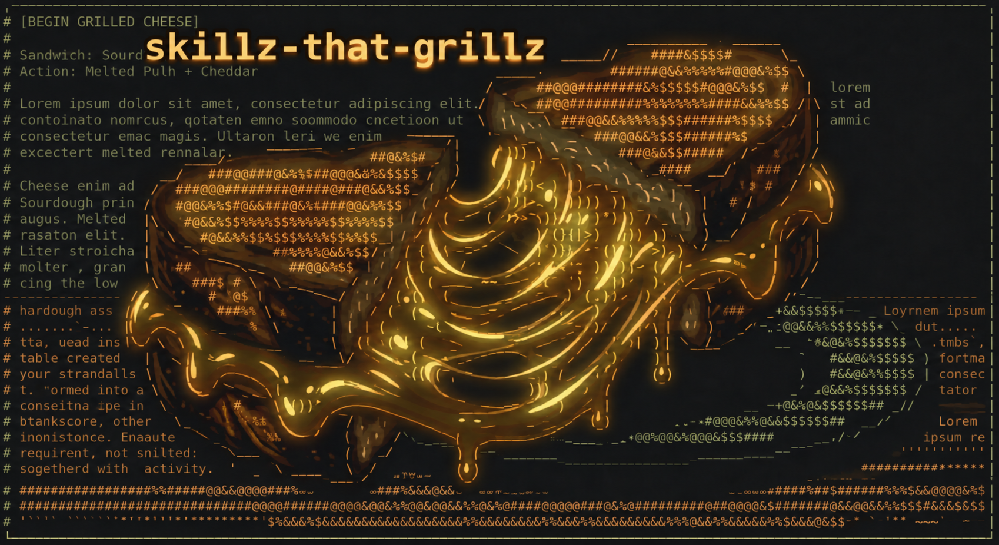

[](https://github.com/paulnsorensen/skillz-that-grillz/actions/workflows/validate.yml)
[](LICENSE)
[](https://github.com/paulnsorensen/skillz-that-grillz/releases/latest)
[](https://www.conventionalcommits.org)
[](https://github.com/paulnsorensen/skillz-that-grillz/pulls)

> _Skill-authoring and skill-packaging toolbelt: skillz, wedge, fromargs, and the wedge GitHub Action._

This repository publishes two Agent Skills, `skillz` and `wedge`. It also hosts two Python
libraries under `lib/` — `wedge` (packages a skill CLI as a content-addressed
`.pyz`) and `fromargs` (the CLI library wedge builds on) — plus the public
[`actions/wedge`](actions/wedge/README.md) GitHub Action that runs `wedge` in
a consumer repository.

The companion repo [easy-cheese](https://github.com/paulnsorensen/easy-cheese)
covers the design / implement / review workflow (mold, cook, press, age, cure)
and local-to-review publication (`/plate`: staging, commits, pushes, and PR
creation — single or stacked).

## Skills

| Skill path | Command | Purpose |
| --- | --- | --- |
| `skills/skillz/SKILL.md` | `/skillz` | Add, improve, audit, or self-update a skill or sub-agent definition so it runs predictably on Claude Code, Codex, OMP, and other Agent Skills hosts. Scores the target against a twelve-lens rubric (predictability, invocation, portability, information hierarchy, tool scoping, calibration, …), tags every finding with severity × confidence, and ships the cross-harness frontmatter matrix, description playbook, anti-pattern catalog, and hooks catalog as references. `audit` and `self-update` add a best-effort Usage lens through a bundled analytics engine. `experiment` uses bundled GEPA and isolated harness execution to compare candidates on paired holdouts and export a private patch. |
| `skills/wedge/SKILL.md` | `/wedge` | Extract repeatable deterministic work into a fromargs CLI and package it with wedge. Covers output contracts, builder limits, and installed-launcher verification. |

`skillz` uses a bundled, standard-library Python inspection helper during audits.
It needs no MCP server or separate `session-analytics` skill. Its Usage
lens uses Python 3, the `duckdb` CLI, readable local session logs, and a
writable cache. The bundled engine keeps the existing
`dotfiles/session-analytics` database path and one-hour cache. Without DuckDB,
`skillz` offers a slower, sampled raw-log scan by read-only subagents. It runs
only with user consent, may omit metrics, and does not replace the database
results. The user can skip Usage.

The optional `experiment` mode needs Codex or a configured trusted harness wrapper.
It needs no source checkout.
See [the experiment workflow](skills/skillz/references/experiments.md).

`wedge` wraps the `wedge` CLI. It needs a uv project with a committed
`uv.lock`, uv, and a locked wedge/shiv environment. Dependencies must be
pure-Python wheels. Installed helpers need Python 3.11+. Release publication
through gh is optional and needs authorization.

```sh
npx skills add paulnsorensen/skillz-that-grillz --skill skillz --skill wedge
```

## Where the other skills went

This repo used to publish more Agent Skills under `skills/`:

- Repository setup and maintenance skills (`release`, `justfile`, `prek`,
  `oss-hygiene`, `safe-settings`, `github-copilot-repo-instructions`) moved to
  [git-gouda](https://github.com/paulnsorensen/git-gouda).
- `gh`, `file-handler`, `github-copilot-personal-instructions`, and `respond`
  are retired, not moved. Use the `gh` CLI directly for GitHub plumbing;
  easy-cheese's `/plate` covers commit/push/PR creation and `/affinage`
  covers PR review-comment triage.

`.agents/skills/python-authoring/` remains: a repo-local skill (not
published) that only applies to work on this repository, mirrored at
`.claude/skills/python-authoring/` via a symlink.

## wedge

`wedge` (`lib/src/wedge/`) shivs a `fromargs` CLI into a skill as a
content-addressed `.pyz`. See [`lib/README.md`](lib/README.md) for the CLI
and [`docs/agents/decisions/wedge-skill-packaging.md`](docs/agents/decisions/wedge-skill-packaging.md)
for the design decisions.

## wedge GitHub Action

[`actions/wedge`](actions/wedge/README.md) packages a pure-Python skill CLI
as a content-addressed `.pyz` release asset in your own repository. Use it to
check locks on pull requests and to publish assets after a merge:

```yaml
- uses: paulnsorensen/skillz-that-grillz/actions/wedge@<full-commit-sha>
  with:
    command: publish # or: check
    roots: skills
```

## fromargs

`fromargs` (`lib/fromargs/`) is the CLI argument-parsing library `wedge`
builds its CLI on. See [`lib/fromargs/README.md`](lib/fromargs/README.md).

## Development

```sh
git clone https://github.com/paulnsorensen/skillz-that-grillz.git
cd skillz-that-grillz
just build   # runs all formatters, linters, and test suites
```

See [`CONTRIBUTING.md`](CONTRIBUTING.md) for the full contribution guide.

## License

MIT — see [LICENSE](LICENSE).
